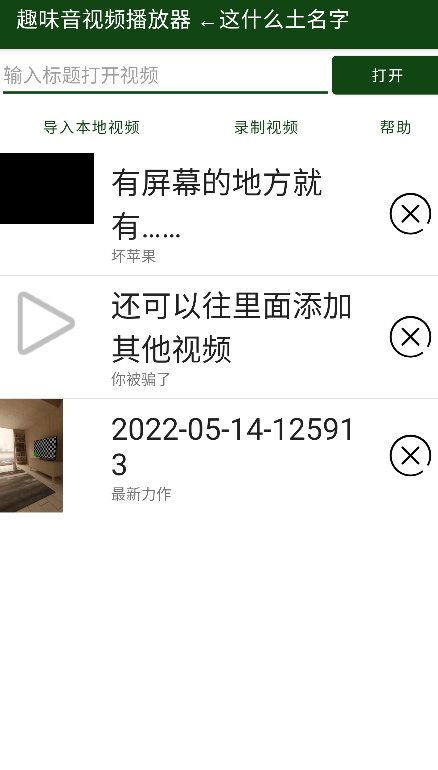
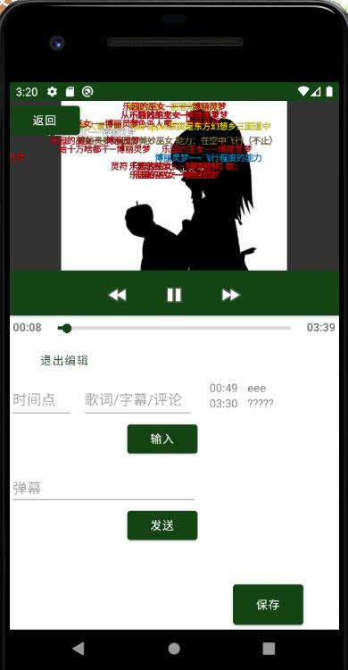

# 趣味本地音视频播放器

## 小组成员

陈镕，韩亦多BRIANHAN，陈景浩，邹铭宸

## 正儿八经的软件介绍

这是一个趣味音视频播放器，它可以导入本地视频或录制新视频后播放。如果你对任何地方感到疑惑，程序的“帮助”页或许能帮到你。除了传统视频播放器的开始/暂停以及快进/快退功能以外，对于给定的视频，它能加载已有弹幕，也可以加入新弹幕和设定时间点字幕等，让观影过程更加有趣！

视频新弹幕发送页（编辑页）

## 主要技术
文件系统存储

UI动画制作

自定义UI控件

多媒体权限调用

视频加载、播放、控制技术

Activity间互相交互

应用程序生命周期监听

动作监听

列表刷新技术

Kotlin数据类

## 一些奇奇怪怪的群聊天记录

*再见了，jvav*

@satgo1546：还剩两周左右的时间🐶本来想整个QArt生成器啊，数字电路教学应用啊，更好用的浏览器啊，不过我在B站上看到一个[让人眼前一黑的好活](https://www.bilibili.com/video/av424928423)，我们整个安卓版也不是不行，还可以加个定时和结算假装做了个音游。

@Daniel-ChenJH：确实有意思。

@OvertheBrain：活有点太狠了。以这学期学的技术感觉做游戏有点难（？）可以沿用这个思路做一个音视频播放器。想了一个趣味音视频播放器：可以app里内置几个音乐/视频，用户可以往app里导入用特定格式编写的歌词本，软件将歌词展示成类似于视频里的样子，并将音视频根据歌词分块——就是分割歌词，像音乐软件里根据歌词播放。

@stevenzmc：这样的话我们是要根据歌词本生成不同的控件来展示歌词吗？

@satgo1546：“特定格式的歌词本”指XML layout（不是）。如果不想整活浓度过高的话就不要搞各种控件了，自定义一个歌词显示视图，自己绘制就是。

@OvertheBrain：主要layout真没啥控件可以用……原生开发有什么成熟的组件库吗？我之前开发app都是用React-Native的（

@satgo1546：确实，WinForm有现成的ListBox可以用，Android连回收视图转接器也得自己写。可能每种组件各有一些成熟的库，就用很长很长的依赖列表掩盖过去吧！

---

*两天后*

@OvertheBrain：但我在想做这么一个东西出来没啥屌用，而且学到的知识也没用几个，比如[他们给我们的API](https://bd-open-lesson.bytedance.com/#/apiList)不用感觉怪浪费的。还有就是可行性：每首歌的歌词都是不一样的，怎么区分，怎么播放。

@satgo1546：思考：没有屌用是否是其最大的屌用？要说的话多媒体、UI、动画，还是用得蛮足的。我个人倾向于不要用给的API……这会使有人三十年后把作业APK翻出来回忆（挖黑历史）时发现运行不了，原因是API已经没了。
关于带歌词音视频播放，ASS字幕和LRC歌词文件给出了标准解决方案：同目录下同名不同扩展名的文件即是对应歌词文件。又例如实现动画时，也可以参考ASS中的动画效果指令等。这么说来，创意性又没有了，不如还是做音游算了（x
其他两人有何想法？

@stevenzmc：搞个本地音频/视频库app？比较类似的我就想到这个。

---

*一周后*

@satgo1546：好耶，拖到只剩一周了！不管怎么样先把库建起来吧。……我都邀请了，被邀请者需要登上GitHub手动确认一下🐱 鉴于除了趣味本地音视频播放库以外没有其他想法，就做这个吧。

@Daniel-ChenJH：可以。

---

## 关于名字

媒体播放器Media Player Classic的图标是写有数字“321”的场记板，而更现代的界面引向象征着下一代的“002”，故名321002。

——当然不是这样。这个数字只是从random.org随机生成的0到999999之间的随机数。

---

*5月1日*

@satgo1546：昨天花了大约四个小时整了个基础的视频播放器。（此处有两张应用截图。）明明代码才两百行。原生开发是这样的……

@OvertheBrain：提问，为啥是绿的？

@satgo1546：你取个色看十六进制值就知道了。……然后就在考虑歌词本的格式。实现歌词按时间显示出来并不困难：我已经把框架搭好了，只要在刷新进度条的时候顺便把歌词也刷新了就是。但是，因为是趣味播放器……
另外，加载外部视频的功能也完全没做。👻 目前的视频都是直接塞在资源文件里随app编译打包的，也导致仓库克隆要花很久（

@OvertheBrain：以我现在学过的组件确实想不出怎么趣味。而且我们有学过怎么加载外部视频吗？

@satgo1546：靠，这也太合理了，确实没学过……（突然发现了课件里的一行小字：“`void setVideoURI(Uri uri)`：以Uri的方式设置VideoView播放的视频源，可以是**网络Uri**或本地Uri”。）

@OvertheBrain：那可以用他给的那个API玩玩了。

@satgo1546：整挺好。我在（播放页右上角）弄了个可以显示一个边栏的功能，标签是“编辑”但其实里面什么都没做，你要做查看评论之类的话可以直接往里面删改，加油🐱 ……我突然发现这样是不是可以做成弹幕视频网站？怪起来了。

@OvertheBrain：确实。歌词展示要怎么整出有趣的互动形式是个问题。

---

*两天后*

@satgo1546：（此处有一张应用截图。）我做了（弹幕）绘制，内容来源还是内嵌资源。

---

*不到一周后*

老师：五一放假，大作业报告延期到下周。

---

*12日晨*

@OvertheBrain：很好，我们现在满打满算只剩两天半。我想了一下，这个项目具体可以做的功能。

（首页）这一块我加了几个功能（UI是空的，功能尚未实现）：

- 打开系统视频：调用系统相机或者相册，打开内部视频，并存放到列表里
- 获取视频列表：点击按钮跳出搜索框，用字节给的API拉取视频列表，用返回的视频地址播放视频
- 帮助：文档工作

至于（播放页）这里，主要是一个音视频编辑功能和分享功能。音视频编辑主要在下面的编辑区域，计划是分成两半：一边是一个输入框，输入时间点和歌词（也可以是弹幕），输入完后另一边会出现一个控件（怎么设计看人），点击控件可以跳转到对应时间点并在视屏附上对应弹幕（弹幕可永久保存）。分享功能是通过调用字节给的短视频发布API来实现。

所以现有的任务是：

- 搜索栏的过滤功能
- 调用系统内部相机功能
- 拉取视频列表功能
- 音视频编辑功能
- 分享功能
- UI优化（如果时间允许，可以做个登录界面，固定用户的学生ID，用于API调用）

@OvertheBrain：@全体成员 醒了的话看一下任务可行不可行，可行的话挑一两个任务来认领吧，时间紧迫（

@OvertheBrain：@satgo1546 还有关于视频信息的存储，因为这个项目应该是要做持久化存储的，视频信息用List文件存的方式可能要改成课上讲的持久化存储，你可以看一下统一规定一个存储方案。

@satgo1546：我认为这任务量太恐怖了。现在只剩两天了，至少要砍掉一半。根据砍掉哪一半，我建议以下两种路线：

- 使用字节跳动给的API，所有数据全部存储在云端：免去所有持久化事项
- 不使用任何网络功能，所有数据保存在本地：免去所有网络事项

我调查了现在已经在作业本中提交项目地址的5个大作业。其中：

- 4个是单人组，1个是两人组
- 1个项目使用了字节跳动提供的API。该项目成员在一周和两周前在课程群中询问过API调用异常问题，至今没有得到任何回应
- 1个项目使用了很多个其他第三方API。该项目内容丰富，完成度极高（相对），推测该成员有过相关开发经验
- 1个项目使用了网络资源（但不是API）。虽然是抖音再世，其实只做了界面
- 2个项目没有使用任何网络资源
- 4个项目使用了SQLite数据库，其中1个项目使用了Room

字节跳动提供的API少有人用，用过的人都说坏，存在大量不稳定和不确定因素。结合作业期限，故决定将所有数据保存在本地。

删去与网络相关的功能，剩下的待实现任务如下。

- 搜索栏的过滤功能
- 调用系统相机或相册（择一），将所得视频导入到视频列表中
- 发送弹幕程度的能力
- 数据持久化：方案、显示本地视频列表、在本地保存发送的弹幕
- 帮助：文档工作

@stevenzmc：文档和展示PPT我来吧，最近忙毕设有点抽不开身。

@Daniel-ChenJH：我也一起弄帮助文档和PPT制作吧[泪奔]技术活实在干不来。

@satgo1546：草，两个人一起做PPT那也太怪了，这可是Android项目啊。你们谁选一个写app内的使用说明界面吧，这个活就是在Android Studio里拖拖拖的，不用写代码。

……

@OvertheBrain：我做1（过滤视频列表）和3（发送弹幕）吧。顺便UI这方面你觉得有啥可以优化的？比如给视频加个封面图显示之类的。可以丰富一下列表项，加个删除按钮啥的。

@satgo1546：我不知道怎么从视频里提取封面……哦Android好像有现成API。现在主页的列表因为图方便用的是ListView，缩略图加载是耗时操作，这不会很容易，如果还有时间的话再说吧（

@OvertheBrain：不用RecyclerView是因为用起来太sb了吗？

@satgo1546：是啊。这么抽象的控件有什么使用的必要吗？我在刻意避开过度设计的那些东西。比如播放页里本来有个功能是无操作3秒后把暂停按钮和进度条隐藏，因为Handler太烦了就删掉了；Menu也没有用资源，直接在Activity里手动创建。不过确实现在这个主界面看起来过于简陋了。

关于持久化方案，考虑到屑安卓对文件权限瞎几把乱限，Android的SQLite也遵从着过度设计的原则，而且总不能把几十MB的视频塞到数据库里吧……我认为持久化的好方案是直接用文件系统：在私有存储目录下查询*.xml获得视频列表，文件名是视频名，XML是弹幕文件，同名的另一个文件就是视频内容。

@OvertheBrain：我觉得可。另外我想把时间点也存起来，类似于一个保存歌词本的功能。你能想象出我在说什么吗？

@satgo1546：时间点就直接按弹幕格式存在XML里应该就可以。输入框的内容存在 `<d></d>`之间，时间点存在 `p=""`里。

@OvertheBrain：我是说用户自己输入的时间点，这个时间点是要显示在下面的那个UI里的。或者说你想把这么多弹幕都塞到下面去？

@satgo1546：没错。如果想要歌词和弹幕分开的话，加一个flag就是。例如，认定底部弹幕是歌词，在编辑界面里只显示底部弹幕。

@OvertheBrain：好主意。

---

*一天后*

@OvertheBrain：把filter给做好了，顺便优化了一下UI。删除功能因为目前存储没做好，所以应该是不能用的，@satgo1546 我给视频加了个description属性，你可以看着加。
